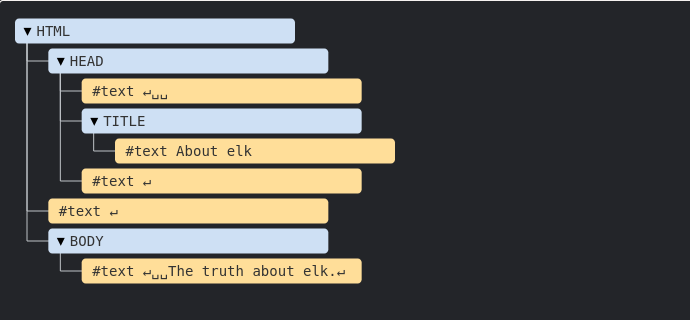
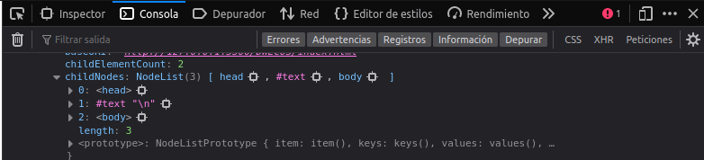
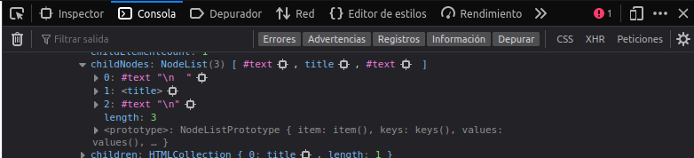
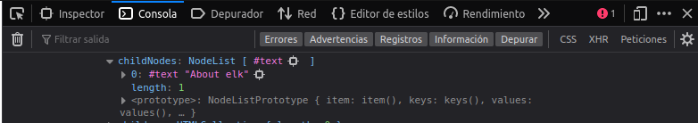
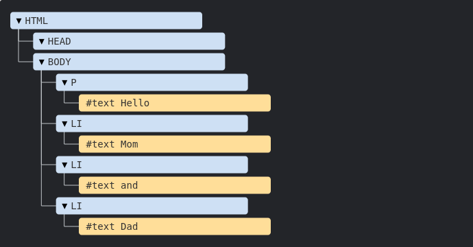

# DWEC UT03: Modelo de objetos del documento (DOM) y gestión de eventos.

## Modelo de Objetos de Documento (DOM)

Ya hemos visto en el tema anterior como el DOM es el objeto que se encarga de definir la estructura del documento HTML que está renderizando el navegador. Un documento HTML esta formado por multitud de etiquetas (`tags`) que anidadas entre si forma un árbol de etiquetas que forman la página web que estamos visualizando.

Veamos como es esta estructura de un documento HTML en profundidad.

```html
<!DOCTYPE HTML>
<html>
<head>
  <title>About elk</title>
</head>
<body>
  The truth about elk.
</body>
</html>
```

El documento de arriba se convierte en la siguiente estructura de nodos.

<p align="center"> 

</p>

Principalmente existen 2 tipos de nodos:

Vemos como las etiquetas HTML como `<html>`, `<head>` o `<body>` son nodos `element`, y estos a su vez pueden contener más nodos dentro. 

Los nodos de texto solo pueden contener texto (`string`) en su interior. 

Vemos como aparecen unos nodos de texto entre el `<head>` y `<title>`, que corresponden al retorno de carro (línea nueva) y los 2 espacios de identación de nuestro código HTML. Todo el documento es representado en esta estructura del DOM y es por eso que aparecen como hijos del nodo `<head>`.

Podemos comprobar esto utilizando la herramientas de depuración del navegador y analizar el objeto `document` en la consola. Utilizando la propiedad `childNodes` podremos ver que hay dentro de los diferentes nodos que conforman todo el DOM.

<p align="center"> 

</p>

<p align="center"> 

</p>

<p align="center"> 

</p>

Hay solo dos excepciones de nivel superior:

* Los espacios y líneas nuevas ubicados antes de la etiqueta `<head>` son ignorados por razones históricas.
* Si colocamos algo después de la etiqueta `</body>`, automáticamente se situará dentro de body, en el final, ya que la especificación HTML necesita que todo el contenido esté dentro de la etiqueta `<body>`. No puede haber espacios después de esta.

## Autocorreciones en el DOM

Si el navegador encuentra HTML mal escrito, lo corrige automáticamente al construir el DOM.

Por ejemplo, la etiqueta superior siempre será `<html>`. Incluso si no existe en el documento, ésta existirá en el DOM, puesto que el navegador la creará. Sucede lo mismo con la etiqueta `<body>`.

Como ejemplo de esto, si el archivo HTML es la palabra "Hello", el navegador lo envolverá con las etiquetas `<html>` y `<body>`, y añadirá la etiqueta `<head>` la cual es requerida.

Al generar el DOM, los navegadores procesan automáticamente los errores en el documento, cierran etiquetas, etc.

Un documento sin etiquetas de cierre como este:

```html
<p>Hello
<li>Mom
<li>and
<li>Dad
```
Se convierte en la siguiente estructura de DOM:

<p align="center"> 

</p>

## Otros tipos de nodo

Otro tipo de nodos son los comentarios en el código JS. Podemos pensar: ¿Por qué se agrega un comentario al DOM? Esto no afecta la representación de ninguna manera. Pero hay una regla: si algo está en el código HTML, entonces también debe estar en el árbol DOM.

Hasta la declaración `<!DOCTYPE...>` al principio del HTML es un nodo del DOM. Su ubicación en el DOM es justo antes de la etiqueta <html>.

Hay 12 tipos de nodos ([enlace](https://dom.spec.whatwg.org/#node)). En la práctica generalmente trabajamos con 5 de ellos:

* `document` – el “punto de entrada” en el DOM.
* nodos `element` – etiquetas-HTML, los bloques de construcción del árbol.
* nodos de texto – contienen texto.
* comentarios – Podríamos colocar información allí. No se mostrará, pero JS puede leerla desde el DOM.
* `Attr`: representa el par nombre-de-atributo/valor.
