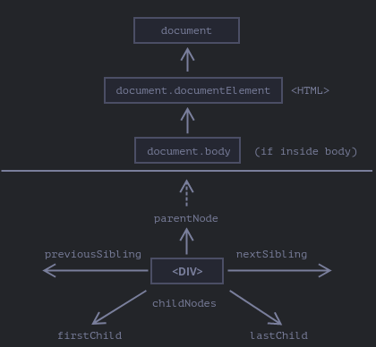
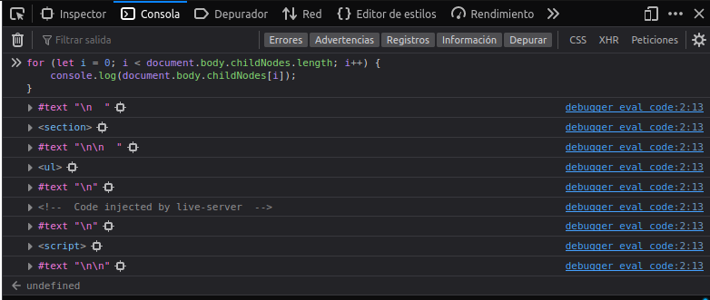
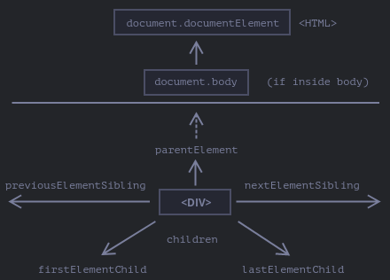
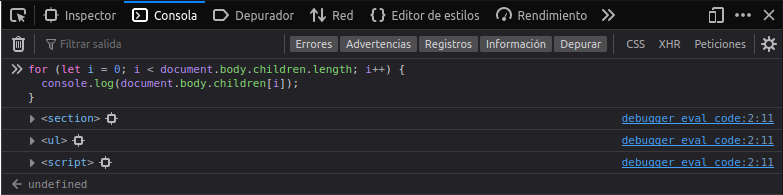

# DWEC UT03: Modelo de objetos del documento (DOM) y gestión de eventos.

## Navegando a traves de los elementos del DOM

El DOM nos permite hacer cualquier cosa con sus elementos y contenidos, pero lo primero que tenemos que hacer es llegar al objeto correspondiente del DOM.

Todas las operaciones en el DOM comienzan con el objeto `document`. Este es el principal “punto de entrada” al DOM. Desde ahí podremos acceder a cualquier nodo.

<p align="center"> 

</p>

### Nodos superiores (top level)

Los tres nodos superiores están disponibles como propiedades de `document`:

* `<html>` = `document.documentElement` -  El nodo superior del documento es "document.documentElement". Este es el nodo del DOM para la etiqueta `<html>`.
* `<body>` = `document.body` - Otro nodo muy utilizado es el elemento `<body>` "document.body".
* `<head>` = `document.head` - La etiqueta `<head>` está disponible como "document.head".

### Nodos hijos

Existen dos términos que vamos a utilizar de ahora en adelante:

* **Nodos hijos** (`childNodes`) – elementos que son hijos directos, es decir sus descendientes inmediatos. Por ejemplo, `<head>` y `<body>` son hijos del elemento `<html>`.
* **Descendientes** – todos los elementos anidados de un elemento dado, incluyendo los hijos, sus hijos y así sucesivamente.

Por ejemplo, aquí `<body>` tiene de hijos `<div>` y `<ul>` (y unos pocos nodos de texto en blanco):

```html
<html>
<body>
  <section>Sección</section>

  <ul>
    <li>
      <b>Información</b>
    </li>
  </ul>
</body>
</html>
```

…Y los descendientes de `<body>` no son solo los hijos `<div>`, `<ul>` sino también elementos anidados más profundamente, como `<li>` (un hijo de `<ul>`) o `<b>` (un hijo de `<li>`) del subárbol entero.

La colección `childNodes` enumera todos los nodos hijos, incluidos los nodos de texto. Podemos comprobarlo con el documento HTML anterior y las herramientas de depuración utilizando el siguiente bucle `for`.

```js
for (let i = 0; i < document.body.childNodes.length; i++) {
  console.log(document.body.childNodes[i]); 
}
```

<p align="center"> 

</p>

### `Childnodes` como colección

Como podemos ver, `childNodes` parece un array pero realmente no es un array, sino más bien una colección (un objeto especial iterable), parecido a un array. Hay dos importantes consecuencias de esto:

* Podemos usar `for..of` para iterar sobre él
* Los métodos de `Array` no funcionan, porque no es un array.

La primera consecuencia es *agradable*. La segunda es *tolerable*, porque podemos usar `Array.from()` para crear un array “real” desde la colección si es que queremos usar métodos del array.

> #### *Tener en cuenta que ...*
> Las colecciones DOM, incluso más-- todas las propiedades de navegación enumeradas en este capítulo son sólo de lectura. No podemos reemplazar a un hijo por otro elemento asignándolo así `childNodes[i] = ....`

### Familiares de nodos

La propiedad `childNodes` enumera los nodos "hijos" dentro de un nodo, pero tambien tiene mas "familia". Los nodos **hermanos** son nodos que son hijos del mismo padre.

```html
<html>
  <head>...</head><body>...</body>
</html>
```

En este ejemplo, `<head>` y `<body>` son hermanos:

* `<body>` se dice que es el hermano "siguiente" o a la "derecha" de `<head>`.
* `<head>` se dice que es el hermano “anterior” o a la “izquierda” de `<body>`.

El hermano siguiente está en la propiedad `nextSibling` y el anterior en `previousSibling`.

El padre está disponible en `parentNode`.

```js
// el padre de <body> es <html>
console.log(document.body.parentNode === document.documentElement); // verdadero

// después de <head> va <body>
console.log(document.head.nextSibling);       // HTMLBodyElement

// antes de <body> va <head>
console.log(document.body.previousSibling);   // HTMLHeadElement
```

Las propiedades `firstChild` y `lastChild` dan acceso rápido al primer y al último hijo de un nodo. Son solo atajos. Si existieran nodos hijos, la respuesta siguiente sería siempre verdadera:

```js
elem.childNodes[0] === elem.firstChild
elem.childNodes[elem.childNodes.length - 1] === elem.lastChild
```

### Navegar solo por nodos `element`

Las propiedades de navegación enumeradas antes se refieren a todos los nodos. Por ejemplo, en `childNodes` podemos ver nodos de texto, nodos elementos; y si existen, incluso los nodos de comentarios.

Pero para muchas tareas no queremos los nodos de texto o comentarios. Queremos manipular el nodo que representa las etiquetas y formularios de la estructura de la página.

Así que vamos a ver más enlaces de navegación que solo tienen en cuenta los elementos nodos:

<p align="center"> 

</p>

Los enlaces son similares a los de arriba, solo que tienen dentro la palabra Element:

* `children`: solo esos hijos que tienen el elemento nodo.
* `firstElementChild`, `lastElementChild`: el primer y el último elemento hijo.
* `previousElementSibling`, `nextElementSibling`: elementos vecinos.
* `parentElement`: elemento padre.

Aqui podemos ver el documento HTML de antes pero utilizando `children` en vez de `childNodes`.

<p align="center"> 

</p>

> #### *Tener en cuenta que ...*
> ¿Por qué `parentElement`? ¿Puede el padre no ser un elemento?
> La propiedad `parentElement` devuelve el “elemento” padre, mientras `parentNode` devuelve “cualquier nodo” padre. Estas propiedades son normalmente las mismas: ambas seleccionan el padre.


Hasta ahora hemos descrito las propiedades de navegación básicas. Ciertos tipos de elementos del DOM pueden tener propiedades adicionales, específicas de su tipo, por conveniencia.

Las tablas son un gran ejemplo de ello, y representan un particular caso importante.

> Algunos tipos de elementos del DOM, por ejemplo las tablas, proveen propiedades adicionales y colecciones para acceder a su contenido. ([enlace](https://www.w3schools.com/jsref/dom_obj_table.asp)).

### Metodos de nodos

Existen metodos útiles para saber si un nodo tiene hijos. El método `hasChildNodes()` devuelve un valor `boolean` indicando si el nodo especificado tiene nodos hijos o no.

```js
let foo = document.getElementById("foo");

if (foo.hasChildNodes()) {
  // Do something with 'foo.childNodes'
}
```