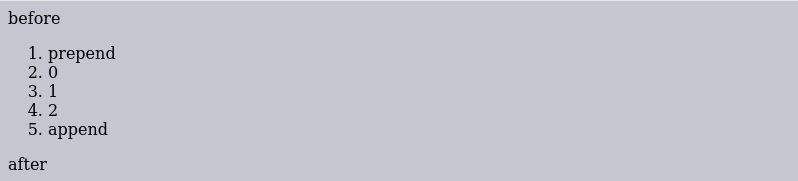
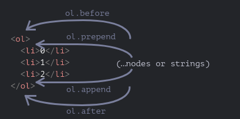
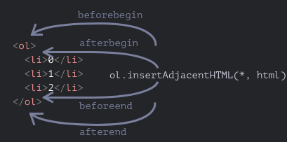

# DWEC UT03: Modelo de objetos del documento (DOM) y gestión de eventos.

## Creación y borrado de nodos

Lo normal suele ser crear código HTML desde un fichero HTML "estático". Sin embargo, y sobre todo con el auge de las páginas SPA (Single Page Application) y los frameworks o librerías Javascript, esto ha cambiado bastante y es muy frecuente crear código HTML desde Javascript de forma "dinámica".

La modificación del DOM es la clave para crear páginas “vivas” (dinámicas). Aquí veremos cómo crear nuevos elementos “al vuelo” y modificar el contenido existente de la página.

### Creación de nodos

Existen una serie de métodos para crear de forma eficiente diferentes elementos HTML o nodos, y que nos pueden convertir en una tarea muy sencilla el crear estructuras dinámicas, mediante bucles o estructuras definidas.

| Método  | Descripción |
|----------|----------|
| `.createElement(tag, options)` | Crea y devuelve el elemento HTML definido por `tag` |
| `.createComment(text)` | Crea y devuelve un nodo de comentarios HTML `<!-- text -->` |
| `.createTextNode(text)` | Crea y devuelve un nodo HTML con el texto `text` |
| `.isConnected` | Indica si el nodo HTML está insertado en el documento HTML |

Mediante el método `.createElement()` podemos crear un nodo `element` HTML en memoria (¡no estará insertado aún en nuestro documento HTML!). Con dicho elemento almacenado en una variable o constante, podremos modificar sus características o contenido, para posteriormente insertarlo en una posición determinada del DOM o documento HTML.

```js
const div = document.createElement("div");      // Creamos un <div></div>
const p = document.createElement("p");          // Creamos un <p></p>
const img = document.createElement("img");      // Creamos un 
```

Para crear nodos de texto o comentario utilizaremos de la misma manera los metodos correspondientes. Aunque tal vez no sea tan habitual utilizar estos metodos.

```js
const comentario = document.createComment("Comentario");    // <!--Comentario-->
const texto = document.createTextNode("Hola");              // Nodo de texto: 'hola'
// Aun faltaria añadir el nodo texto como hijo del nodo element correspondiente.
```

Puede ser mas habitual ver modificaciones accediendo a propiedades del nodo `element`. OJO! Generando posibles nodos hijos en función de lo que añadamos o modifiquemos.

```js
// Crear nodo <div>
let div = document.createElement('div');
// Modificar el contenido
div.innerHTML = "<p><strong>Hi there!</strong> You've read an important message.</p>";
```

La propiedad `isConnected` nos indica si el elemento en cuestión está conectado al DOM, es decir, si está insertado en el documento HTML:

* Si devuelve `true`, significa que el elemento está conectado al DOM.
* Si devuelve `false`, significa que el elemento no está conectado al DOM.

### Insertando nodos en el DOM

Hasta ahora, hemos creado elementos que no están en el DOM (permanecen sólo en memoria). Veremos como insertarlos en el documento HTML para que aparezca visualmente en la página.

Aunque mediante propiedades como `.innerHTML` podemos insertar elementos en el DOM de un documento HTML, en muchas ocasiones quizás no es la mejor forma.

Vamos a ver  3 formas (de más tradicional a más moderna) de inserción o modificación de elementos:

* La API de nodos
* La API de elementos
* La API de inserción adyacente

### La API de `node`

La **API de nodos** de Javascript es la más tradicional y antigua, y aunque cumple bien determinados aspectos, suele ser más complicado llegar al objetivo porque no hay ciertos métodos explícitos para hacer determinadas cosas. No obstante, suele ser la más extendida que te encuentras, ya que `.appendChild()` está muy extendido al ser uno de los más usados.

| Método  | Descripción |
|----------|----------|
| `.appendChild(node)` | Añade como hijo el nodo `node`. Devuelve el nodo insertado |
| `.removeChild(node)` | Elimina y devuelve el nodo hijo `node` |
| `.replaceChild(new, old)` | Reemplaza el nodo hijo `old` por `new`. Devuelve `old` |
| `.insertBefore(new, node)` | Inserta el nodo `new` antes de `node` y como hijo del nodo actual |
| `.insertBefore(new, null)` | Inserta el nodo `new` después del último nodo hijo. Equivale a `.appendChild()` |

Veamos algunos ejemplos de utilización de los metodos de nodos

```js
// Crea un nuevo elemento párrafo, y lo agrega al final del cuerpo del documento
const p = document.createElement("p");
document.body.appendChild(p);

//Crear un nodo "li", añadir un nodo de texto, añadir el nodo "li" a un elemento (ul/ol) con id "myList"
const node = document.createElement("li");
const textnode = document.createTextNode("Water");
node.appendChild(textnode);
document.getElementById("myList").appendChild(node);
```

Para borrar un nodo, necesitaremos identificar el nodo en cuestión asi como el nodo padre. En caso ne querer/necesitar utilizar el nodo borrado del DOM (se podria reutilizar en otro lado del código).

```js
const parent = document.getElementById("parent");
const child = document.getElementById("child");
const removeNode = parent.removeChild(child);

// Borrando todos los nodos dentro de un elemento
const element = document.getElementById("idOfParent");
while (element.firstChild) {
  element.removeChild(element.firstChild);
}
```

Con `.replacChild()` podemos reemplazar un nodo con otro que hayamos creado/seleccionado de otro lado.

```html
<div>
    <span id="childSpan">foo bar</span>
</div>
<script>
// crear un nodo con un elemento vacío sin ID, atributos, ni contenido
const sp1 = document.createElement("span");
// darle un atributo id llamado 'newSpan'
sp1.setAttribute("id", "newSpan");
// crear algún contenido para el nuevo elemento
const sp1_content = document.createTextNode("Nuevo elemento span para reemplazo.");
// aplicar dicho contenido al nuevo elemento
sp1.appendChild(sp1_content);
// construir una referencia al nodo existente que va a ser reemplazado
const sp2 = document.getElementById("childSpan");
const parentDiv = sp2.parentNode;
// reemplazar el nodo sp2 existente con el nuevo elemento span sp1
parentDiv.replaceChild(sp1, sp2);
</script>
```

Por último, el método `insertBefore(newnode, node)` es un método más específico y menos utilizado en el que se puede especificar exactamente el lugar a insertar un nodo. El primer parámetro es el nodo a insertar, mientras que el **segundo parámetro** puede ser:

* Inserta `newnode` después del último nodo hijo. Equivale a `.appendChild()`.
* Inserta `newnode` antes de dicho node de referencia.

```html
<div id="parentElement">
  <span id="childElement">foo bar</span>
</div>

<script>
  // Crea un nuevo, elemento <span>
  var sp1 = document.createElement("span");

  // Obtener una referencia al elemento, antes de donde queremos insertar el elemento
  var sp2 = document.getElementById("childElement");
  // Obtener una referencia al nodo padre
  var parentDiv = sp2.parentNode;

  // Inserta un nuevo elemento en el DOM antes de sp2
  parentDiv.insertBefore(sp1, sp2);
</script>
```
### La API de `element`

Los métodos mencionados con anterioridad sirven en muchos casos, sin embargo, son poco específicos y puede que no cubran todas las posibles situaciones. Existe otra familia de métodos para añadir e insertar elementos que quizás sea mucho más versátil.

| Método  | Descripción |
|----------|----------|
| `.before()` | Añade el nuevo elemento justo antes |
| `.after()` | Añade el nuevo elemento justo después |
| `.prepend()` | Se añade el nuevo elemento antes del primer hijo |
| `.append()` | Se añade el nuevo elemento después del último hijo |
| `.replaceChildren()` | Elimina todos los hijos y los sustituye por el nuevo elemento |
| `.replaceWith()` | Se sustituye por el nuevo elemento |
| `.remove()` | Elimina el propio elemento |

Los argumentos de estos métodos son una lista de nodos para insertar o cadenas de texto (que se convierten en nodos de texto automáticamente). A continuación se muestra un ejemplo del uso de estos métodos para agregar elementos a una lista y el texto anterior o posterior.

```html
<ol id="ol">
  <li>0</li>
  <li>1</li>
  <li>2</li>
</ol>

<script>
    const ol = document.getElementById("ol");
    ol.before('before');        // inserta el string "before" antes de <ol>
    ol.after('after');          // inserta el string "after" después de <ol>

    let liFirst = document.createElement('li');
    liFirst.innerHTML = 'prepend';
    ol.prepend(liFirst);        // inserta liFirst al principio de <ol>

    let liLast = document.createElement('li');
    liLast.innerHTML = 'append';
    ol.append(liLast);          // inserta liLast al final de <ol>
</script>
```
<p align="center"> 

</p>

De manera grafica esto es lo que estamos viendo en el ejemplo anterior.

<p align="center"> 

</p>

Cuando utilizamos un `string` para insertar un nodo de texto, son insertados como "texto" y no como HTML. En otras palabras, los `string` son insertados en una manera segura, tal como lo hace `elem.textContent`, evitando que se pueda inyectar código malicioso.

```js
let container = document.createElement("div");
let p = document.createElement("p");
container.appendChild(p);

p.before("Text");

console.log(container.outerHTML);
// "<div>Text<p></p></div>"
```

```html
<div id="div"></div>
<script>
  div.before('<p>Hola</p>');
</script>

<!-- Así quedaría insertado el código -->
&lt;p&gt;Hola&lt;/p&gt;
<div id="div"></div>
```

### La API de inserción adyacente

Probablemente, una de las APIs de manejo del DOM más desconocidas y más interesantes, es la de **inserción de elementos adyacentes**. Son una familia de 3 métodos que permiten hacer prácticamente cualquier operación posible en el DOM.

| Método  | Descripción |
|----------|----------|
| `.insertAdjacentElement(position, element)` | Inserta el `element` en la posición `position`. Se inserta un nodo de tipo `element` (tag HTML)|
| `.insertAdjacentHTML(position, htmlCode)` | Inserta el código HTML de `htmlCode` en la posición `position`. Similar a `.innerHTML` |
| `.insertAdjacentText(position, text)` | Inserta el texto `text` en la posición `position`. Similar a `textContent` |

Ten en cuenta que position es un `string` que puede tener uno de los siguientes valores:

* **beforebegin**: Inserta el elemento antes de la etiqueta HTML de apertura.
* **afterbegin**: Inserta el elemento dentro, antes de su primer hijo.
* **beforeend**: Inserta el elemento dentro, justo antes de la etiqueta HTML de cierre.
* **afterend**: Inserta el elemento después de la etiqueta HTML de cierre.

```html
<div id="div"></div>
<script>
    let div = document.getElementById('div');
    div.insertAdjacentHTML('beforebegin', '<p>Hola</p>');
    div.insertAdjacentHTML('afterend', '<p>Adiós</p>');
</script>
...

<p>Hola</p>
<div id="div"></div>
<p>Adiós</p>
```

<p align="center"> 

</p>

Hay que tener en cuenta que cada versión de `.insertAdjacent` actua sobre un elemento distinto. El método `.insertAdjacentElement()` sobre etiquetas HTML, el método `.insertAdjacentText()` sobre nodos de texto.

```js
// Ejemplo simplificado de como actuaría cada uno

container.insertAdjacentElement("beforebegin", div);
// A) <div>Ejemplo</div> <div class="container">App</div>

container.insertAdjacentHTML("beforebegin", "<p>Hola</p>");
// B) <p>Hola</p> <div class="container">App</div>

container.insertAdjacentText("beforebegin", "Hola a todos");
// C) Hola a todos <div class="container">App</div>
```