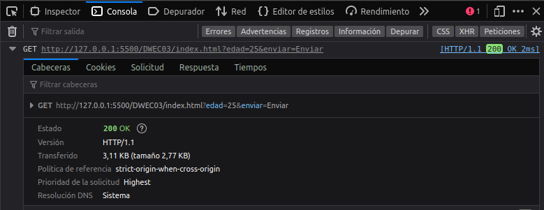

# DWEC UT03: Modelo de objetos del documento (DOM) y gestión de eventos.

## El elemento `<form>`

La mayor parte de interactividad entre una página web y el usuario tiene lugar a través de un formulario. Es ahí donde nos vamos a encontrar con los campos de texto, botones, checkboxes, listas, etc. en los que el usuario introducirá los datos, que luego se enviarán al servidor.

Los formularios y sus controles, son objetos del DOM que tienen propiedades únicas, que otros objetos no poseen. Por ejemplo, un formulario tiene una propiedad `action`, que le indica al navegador donde tiene que enviar las entradas del usuario, cuando se envía el formulario. Un control `select` posee una propiedad llamada `selectedIndex`, que nos indica la opción de ese campo que ha sido seleccionada por el usuario.

JavaScript añade a los formularios dos características muy interesantes:

* JavaScript permite examinar y validar las entradas de usuario directamente, en el lado del cliente.
* JavaScript permite dar mensajes instantáneos, con información de la entrada del usuario.

El objeto de JavaScript `Form`, es una propiedad del objeto `document`. Se corresponderá con la etiqueta `<form>` del HTML. Un formulario podrá ser enviado llamando al método `submit()` de JavaScript, o bien haciendo click en el botón de tipo `submit` (`<input type="submit">`)del formulario.

```html
<div  id="menulateral">
     <form  id="contactar" name="contactar" action="...">...</form>
</div>
```
Se pueden referenciar los elementos de `form` de diferentes maneras. Como ya hemos visto anteriormente podemos seleccionar elementos del documento HTML utilizando los metodos de selección vistos.

```js
let formulario = querySelector('#contactar');
// o utilizando esta otra forma
let formulario = getElementsByTagName('form')[0];
```

Los formularios de un documento HTML son miembros de la collección especial `document.forms`. Utilizando esta colección podemos acceder (de manera nombrada u ordenada) al formulario en cuestión.

```js
document.forms.contactar    //formulario con name='contactar'
document.forms[0]           // primer formulario del documento
```

La propiedad `elements[]` de un formulario es una colección, que contiene todos los objetos `input` dentro de un formulario. Esta propiedad es otro array, con todos los campos `input` en el orden en el cual aparecen en el código fuente del documento.

Generalmente, es mucho más eficaz y rápido referenciar a un elemento individual usando su **ID**, pero a veces, los scripts necesitan recorrer cada elemento del formulario, para comprobar que se han introducido sus valores correctamente.

Una vez que seleccionamos un formulario, tendriamos acceso a todos los elementos `input` que lo forman accediendo a la colección `form.elements`.

```html
<form name="my">
  <input name="one" value="1">
  <input name="two" value="2">
</form>

<script>
  // obtención del formulario
  let form = document.forms.my; // elemento <form name="my">

  // get the element
  let elem = form.elements.one; // elemento <input name="one">

  console.log(elem.value); // 1
</script>
```

Puede haber elementos dentro de un formulario donde diferentes elementos tengan el mismo nombre. En ese caso, `form.elements[nombre]` devolvería una colección.

```html
<form>
  <input type="radio" name="age" value="10">
  <input type="radio" name="age" value="20">
</form>

<script>
let form = document.forms[0];
let ageElems = form.elements.age;
alert(ageElems[0]); // [object HTMLInputElement]
</script>
```

Las propiedad mas importantes de un objeto `form` (algunas pueden definirse como atributos en el HTML) son las siguientes:

| Propiedad/Método  | Descripción |
|----------|----------|
| `action` | Ajusta o devuelve el valor del atributo `action` en un formulario |
| `length` | Devuelve el número de elementos en un formulario |
| `method` | El método (GET/POST) por el que mandamos la información. Corresponde con el atributo METHOD del formulario |
| `name` | Ajusta o devuelve el valor del atributo `name` en un formulario |
| `target` | La página a la que está dirigido el formulario. Corresponde con el atributo target del formulario |
| `reset()` | Resetea los campos de un formulario |
| `submit()` | Envia un formulario a la propiedad especificada en `target` |

## Elementos de un objeto `<form>`

### Elemento `<input>` de tipo texto y `<textarea>`

Algunos de los elementos de tipo texto de los formularios mas comunmente utilizados son: `text`, `password`, `hidden` y el elemento `textarea` (aunque no sea un tipo especifico de `input`). Todos los elementos, excepto los tipos hidden, se mostrarán en la página, permitiendo a los usuarios introducir texto de alguna manera.

Cuando se envían los datos de un formulario a un programa en el lado servidor, lo que en realidad se envía son los atributos `name`, junto con los valores (contenido del atributo `value`) de cada elemento. Sin lugar a dudas, la propiedad más utilizada en un elemento de tipo texto es por lo tanto `value`. Un script podrá recuperar y ajustar el contenido de la propiedad `value` en cualquier momento. Por cierto, el contenido de un `value` es siempre una cadena de texto, y quizás puedas necesitar realizar conversiones numéricas (`number`) si quieres realizar operaciones matemáticas con esos textos.

En este tipo de objetos, los gestores de eventos (que verás más adelante) se podrán disparar de múltiples formas: por ejemplo, cuando pongamos el foco en un campo (situar el cursor dentro de ese campo) o modifiquemos el texto (al introducir el texto).

```html
<html>
  <head>
    <script  type="text/javascript">
    const convertirMayusculas = () => {    
      /*
      En este ejemplo accedemos a la propiedad value de un objeto con id nombre y le asignamos su contenido actual pero convertido a mayúsculas con el método toUpperCase() del objeto String.
      */
      document.getElementById("nombre").value = document.getElementById("nombre").value.toUpperCase();
    }
    </script>
  </head>
<body>
  <h1>Propiedad VALUE de un objeto INPUT de tipo TEXT</h1>
  <form id="formulario" action="pagina.php">
    <p>
      <label for="nombre">Nombre y Apellidos: </label>
      <input  type="text"  id="nombre"  name="nombre"  value="" size="30" onblur="convertirMayusculas()">
    </p>
    <p>Introduce tu Nombre y Apellidos y haz click fuera del campo.</p>
  </form>
</body>
</html>
```

### Elemento `<input>` de tipo `checkbox`

Un `checkbox` es también un objeto muy utilizado en los formularios, pero algunas de sus propiedades puede que no sean muy *intuitivas*. En los botones (`button`) de un formulario la propiedad value nos mostrará el texto del botón, pero en un `checkbox` la propiedad value es un texto que está asociado al objeto. Este texto no se mostrará en la página, y su finalidad es la de asociar un valor con la opción actualmente seleccionada. Dicho valor será el que se enviará, cuando enviemos el formulario.

```html
<label  for="cantidad">Si desea recibir 20 Kg marque esta opción: </label>
<input  type="checkbox" id="cantidad" name="cantidad" value="20 Kg">
```

Si chequeamos este `checkbox` y enviamos el formulario, el navegador enviará el par `name/value` "cantidad" y "20 Kg". Si el checkbox no está marcado, entonces este campo no será enviado en el formulario. El texto del `label` se mostrará en la pantalla pero las etiquetas `label` no se envían al servidor. Para saber si un campo de tipo `checkbox` está o no marcado, disponemos de la propiedad `checked`. Esta propiedad contiene un valor booleano: `true` si el campo está marcado o `false` si no está marcado. Con esta propiedad es realmente sencillo comprobar o ajustar la marca en un campo de tipo checkbox.

```html
<html>
  <head>
    <script type="text/javascript">
      const marcar = () => {
          document.getElementById("verano").checked = true;
      }
      const desmarcar = () => {
          document.getElementById("verano").checked = false;
      }
    </script>
  </head>
  <body>
    <form action="" method="get">
      <label for="verano">¿Te gusta el verano?</label>
      <input type="checkbox" id="verano" name="verano" value="Si"/>
    </form>
    <button onclick="marcar()">Marcar Checkbox</button>
    <button onclick="desmarcar()">Desmarcar Checkbox</button>
  </body>
</html>
```
### Elemento `<input>` de tipo `radio`

El ajustar un grupo de objetos de tipo `radio` desde JavaScript requiere un poco más de trabajo. Para dejar que el navegador gestione un grupo de objetos de tipo `radio`, deberemos asignar el mismo atributo `name` a cada uno de los botones del grupo. Podemos tener múltiples grupos de botones de tipo `radio` en un formulario, pero cada miembro de cada grupo tendrá que tener el mismo atributo `name` que el resto de compañeros del grupo.

Cuando le asignamos el mismo `name` a varios elementos en un formulario, el navegador lo que hace es crear un array con la lista de esos objetos que tienen el mismo `name`. El contenido del atributo `name` será el nombre del `array`. Algunas propiedades, se las podremos aplicar al grupo como un todo; otras en cambio, tendremos que aplicárselas a cada elemento del grupo y lo haremos a través del índice del `array` del grupo. Por ejemplo, podemos ver cuantos botones hay en un grupo radio, consultando la propiedad length de ese grupo.

```js
const radios = objetoFormulario.nombregrupo.length;
```

Y si queremos acceder a la propiedad checked de un botón en particular, lo haremos accediendo a la posición del array y a la propiedad checked.

```js
const seleccionado = objetoFormulario.nombregrupo[0].checked;
```

Podemos ver un ejemplo completo.

```html
<html>
  <head>
    <script>
      const mostrarDatos = () => {
        for  (let i=0;i<document.formulario.actores.length; i++) {
          if  (document.formulario.actores[i].checked)
              alert(document.formulario.actores[i].value);
        }
      }
    </script>
  </head>
  <body>
    <h1>Trabajando con objetos input de tipo radio</h1>
    <form  name="formulario" action="stooges.php">
      <fieldset>
        <legend>Selecciona tu actor favorito:</legend>
        <label for="actor1">Willis</label>
        <input type="radio" name="actores" id="actor1"value="Walter Bruce Willis - 19 de Marzo de 1955" checked>
        <label for="actor2">Carrey</label>
        <input type="radio" name="actores" id="actor-2" value="James Eugene Jim Carrey - 17 de Enero de 1962">
        <label for="actor3">Tosar</label>
        <input type="radio" name="actores" id="actor-3" value="Luis Tosar - 13 de Octubre de 1971">
        <input type="button" id="consultar" name="consultar" value="Consultar Más Datos" onclick="mostrarDatos()">
      </fieldset>
    </form>
  </body>
</html>
```

> Los tipos de objetos de `input` ha ido creciendo con el paso de los tiempos. Aqui puedes consultar más información sobre todos los diferentes tipos de `input` [enlace](https://developer.mozilla.org/en-US/docs/Web/HTML/Element/input)

### Elemento `<select>`

Uno de los controles más complejos que te puedes encontrar en formularios, es el objeto `select`. Un objeto `select` está compuesto realmente de un array de objetos `option`. El objeto `select` se suele mostrar como una lista desplegable en la que seleccionas una de las opciones, aunque también tienes la opción de selecciones múltiples, según definas el objeto en tu documento.

Algunas propiedades pertenecen al objeto `select` al completo, mientras que otras, por ejemplo, sólo se pueden aplicar a las opciones individuales dentro de ese objeto. Si lo que quieres hacer es detectar la opción seleccionada por el usuario, y quieres usar JavaScript, tendrás que utilizar propiedades tanto de `select`, como de `option`.

La propiedad más importante del objeto `select` es la propiedad `selectedIndex`, a la que puedes acceder de las siguientes formas.

```js
const seleccion = objetoFormulario.nombreCampoSelect.selectedIndex;
const otraSeleccion = document.getElementById("objetoSelect").selectedIndex;
```

El valor es el índice de la opción actualmente seleccionada, y recordar que los índices comienzan en la posición 0.

Las opciones tienen dos propiedades accesibles que son `text` y `value`, y que te permitirán acceder al texto visible en la selección y a su valor interno para esa opción.

```html
<option value="valor">texto mostrado</option>
<script>
  const texto = objetoFormulario.nombreCampoSelect.options[n].text;
  const valor = objetoFormulario.nombreCampoSelect.options[n].value;
</script>
```

Veamos un ejemplo completo para que se entienda mejor.

```html
<html>
  <head>
    <script  type="text/javascript">
      const consultar = () => {
        let provincias = document.getElementById("provincias");
        let texto = provincias.options[provincias.selectedIndex].text;
        let valor = provincias.options[provincias.selectedIndex].value;
        alert(`Datos de la opción seleccionada:\n\nTexto: ${texto}\nValor: ${valor}`);
      }
    </script>
  </head>
  <body>
    <h1>Trabajando con un objeto Select</h1>
    <form id="formulario">
      <p>
        <label for="provincias">Seleccione provincia: </label>
        <select name="provincias" id="provincias">
          <option value="AL">Almería</option>
          <option value="JA">Jaen</option>
          <option value="GR">Granada</option>
          <option value="MA">Málaga</option>
          <option value="SE">Sevilla</option>
          <option value="CO">Córdoba</option>
          <option value="CA">Cádiz</option>
          <option value="HU">Huelva</option>
        </select>
      </p>
      <p>
        Selecciona una opción y pulsa el botón.
      </p>
      <input type="button" name="boton" value="Consultar información de la opción" onclick="consultar()"/>
    </form>
  </body>
</html>
```

## Envío y validación de formularios

### Validación de un formulario y sus campos

La validación de un formulario es un proceso que consiste en chequear un formulario y comprobar que todos sus datos han sido introducidos correctamente. Por ejemplo, si tu formulario contiene un campo de texto en el que hay que escribir un e-mail, sería interesante comprobar si ese e-mail está escrito correctamente, antes de pasar al siguiente campo.

La idea general que se persigue al validar un formulario, es que cuando se envíen los datos al servidor, éstos vayan correctamente validados, sin ningún campo con valores incorrectos o maliciosos. A la hora de programar la validación, podremos hacerlo a medida que vamos metiendo datos en el formulario, por ejemplo campo a campo, o cuando se pulse el botón de envío del formulario.

La validación de datos del usuario en la entrada, generalmente suele fallar en alguna de las 3 siguientes categorías:

* **Existencia**: comprueba cuando existe o no un valor.
* **Numérica**: que la información contenga solamente valores numéricos.
* **Patrones**: comprueba que los datos sigan un determinado patrón, como el formato de un e-mail, una fecha, un número de teléfono, un número de la *seguridad social, etc.

La validación de un formulario en el lado del cliente puede ahorrar algunas idas y vueltas a la hora de enviar los datos, pero aún así, tendrás que realizar la validación de datos en el servidor, puesto que es allí realmente donde se van a almacenar esos datos y el origen de los mismos puede venir por cauces que no hemos programado.

Veamos un sencillo ejemplo en el que comprobamos si el valor de un campo de texto cumple alguna condición que le pongamos antes de enviar el formulario.

```html
<html>
<head>
  <meta http-equiv="Content-Type" content="text/html; charset=utf-8" />
  <title>Validación de un Formulario</title>
  <script type="text/javascript">
    const validar = () => {
      let edad = document.getElementById('edad').value;
      if (edad >= 18 && confirm("¿Deseas enviar el formulario?"))
        return true;
      else {
        alert('Lo siento, pero no eres mayor de edad.')
        document.getElementById('edad').classList.add('error');
        this.event.preventDefault();
        return false;
      }
    }
  </script>
  <style type="text/css">
    fieldset {
      background: #CCFF99;
      width: 350px;
    }
    .error {
      border: solid 2px #FF0000;
    }
  </style>
</head>
<body>
  <fieldset>
    <legend>Validación de un Campo</legend>
    <form name="formulario" id="formulario" method="get">
      <label for="edad">Edad:</label>
      <input name="edad" type="text" id="edad" maxlength="3" />
      <input type="submit" name="enviar" id="enviar" value="Enviar" onClick="validar()" />
      <input type="reset" name="limpiar" id="limpiar" value="Limpiar" />
    </form>
  </fieldset>
</body>
</html>
```

> A la hora de contemplar la validación de un formulario no podemos olvidar la aparición de nuevos atributos en los documentos HTML. [Enlace](https://www.freecodecamp.org/news/form-validation-with-html5-and-javascript/)

### Expresiones regulares

Las *expresiones regulares* son patrones de búsqueda, que se pueden utilizar para encontrar texto que coincida con el patrón especificado.

Necesitamos detectar si un nombre empieza con las letras «p» o «s» y además termina con las letras «o» o «a». Es decir, necesitamos comprobar si se cumplen dos restricciones con dos posibilidades cada una.

Esto podríamos hacerlo de varias formas, por ejemplo:

* Extraer la primera y última letra y detectar los nombres que coinciden.
* Escribir una expresión regular que detecte los nombres que coinciden.

```js
const names = ["Pedro", "Sara", "Miriam", "Nestor", "Adrián", "Sandro"];

// Comprobación sin usar expresiones regulares
names.forEach(function(name) {
  const firstLetter = name.at(0).toLowerCase();
  const lastLetter = name.at(-1).toLowerCase();
  if ((firstLetter === "p" || firstLetter === "s") && (lastLetter === "o" || lastLetter === "a")) {
    console.log(`El nombre ${name} cumple las restricciones.`);
  }
});

// Comprobación usando expresiones regulares
names.forEach(function(name) {
  const regex = /^(p|s).+(o|a)$/i;
  if (regex.test(name)) {
    console.log(`El nombre ${name} cumple las restricciones.`);
  }
});
```

Existen diferentes manera de crear una expresión regular.

| Constructor  | Descripción |
|----------|----------|
| `new RegExp(regexp, flags)` | Crea una nueva expresión regular a partir de regexp con los flags indicados |
| ` /regexp/flags` | Simplemente, la expresión regular regexp entre barras /. Notación preferida |

> #### *Tener en cuenta que ...*
> En Javascript, se prefiere utilizar las barras / para delimitar una expresión regular en una variable. Se trata de una forma más corta y compacta que evita tener que escribir el new del objeto `regexp`

Así pues, podríamos crear expresiones regulares de estas dos formas.

```js
// Notación literal (forma preferida)
const regexp = /.a.o/i;

// Notación de objeto
const regexp = new RegExp(".a.o", "i");
const regexp = new RegExp(/.a.o/, "i");
```

<p align="center"> 

</p>


* Los **slash** / (azul) son los delimitadores de las partes de una expresión regular.
* La **definición de la expresión regular** (verde) es un texto con símbolos especiales que indica que textos va a incluir.
* Los **flags** (amarillo), son una serie de carácteres que indican como funcionará la expresión regular.

En nuestro ejemplo concreto, el texto ".a.o" es una expresión regular muy sencilla que usa el carácter especial punto (.) que simboliza un comodín (cualquier carácter). Por otro lado, la a y la o son carácteres normales.


* La palabra "caso" se aceptaría  (la "c" y la "s" encajan donde el .)
* La palabra "cosa" no se aceptaría  (la "o" y la "a" no tienen el orden correcto)
* La palabra "saco" se aceptaría  (la "s" y la "c" encajan donde el .)
* La palabra "marco" no se aceptaría  (el segundo . es un comodín para un carácter, "rc" son dos)
* La palabra " amo" se aceptaría  (el carácter espacio en blanco también es un carácter)
* La palabra "amo" no se aceptaría  (no hay un carácter antes de la a)

Además, tenemos el flag "i" activado, que significa que no diferencia mayúsculas de minúsculas, por lo tanto:


* La palabra "cAsO" se aceptaría. 
* La palabra "casO" se aceptaría.
* La palabra "cAso" se aceptaría.

### Propiedades y flags de un `regexp`

Cada expresión regular creada, tiene unas propiedades definidas, donde podemos consultar ciertas características de la expresión regular en cuestión.

| Propiedades  | Descripción |
|----------|----------|
| `.source` | Devuelve la expresión regular original definida (sin los flags) |
| `.flags` | Devuelve los flags activados en la expresión regular |
| `.lastIndex` | Devuelve la posición donde detectó una ocurrencia en la última búsqueda |

Como hemos comentado a una expresión regular le podemos activar diferentes flags, veamos su significado.

| Propiedades | Flag | Descripción |
|----------|---|----------|
| `.global` | `g` | Búsqueda global. Permite seguir buscando coincidencias en lugar de pararse al encontrar una |
| `.ignoreCase` | `i` | Le da igual mayúsculas y minúsculas. Se suele denominar insensible a mayús/minús |
| `.multiline` | `m` | Multilínea. Permite a `^` y `$` tratar los finales de línea `\r` o `\n` |
| `.unicode` | `u` | Unicode. Interpreta el patrón como un código de una secuencia Unicode |
| `.sticky` | `y` | Sticky. Busca sólo desde la posición indicada por `lastIndex` |
| `.dotAll` | `s` | Establece si `\n`, `\r`, separación de párrafo o separación de línea deberían considerarse en los  |
| `.hasIndices` | `d` | Establece si al ejecutar un `.exec()` el resultado deberá tener propiedad `.indices` |

```js
const regexp = /reg/;                       // No tiene ningún flag activado
const regexp2 = /reg/i;                     // Tiene el flag "i" activado
const regexp3 = new RegExp(/reg/, "gi");    // Tiene el flag "g" activado
console.log(regexp.source);                 // "reg"
console.log(regexp2.flags);                 // "i"
```

Veamos alunas falgs de las mas habituales a través de unos ejemplos.
Si no utilizamos ninguna flag, observar que al ejecutar el método `.test()` para buscar coincidencias, encuentra la primera y no continua buscando. La propiedad .lastIndex siempre devuelve 0:

```js
const text = `Hola Mundo,
Esto es un texto en varias
lineas que se 
utilizara para buscar texto
con expresiones regulares 
de texto`;

const regexp = /t..t./;
regexp.lastIndex      // 0
regexp.test(text);    // true
regexp.lastIndex      // 0
regexp.test(text);    // true
regexp.lastIndex      // 0

const regexp2 = /t..t./g;
regexp.lastIndex      // 0
regexp.test(text);    // true
regexp.lastIndex      // 81
regexp.test(text);    // true
regexp.lastIndex      // 117
```

Sin embargo, vamos a hacer lo mismo con el flag de la búsqueda global activado. Comprobarás que en este caso, el método `.test()` va buscando las coincidencias sucesivas y va devolviendo en `.lastIndex` la posición donde las ha encontrado.

Ten en cuenta que una vez `.test()` devuelve false, la búsqueda se reinicia y comenzarías a buscar desde el principio nuevamente.

La propiedad `.multiline` (flag `m`), permite considerar el texto como un texto multilinea, es decir, si en la expresión regular se utilizan anclas de inicio `^` o final `$` de línea, la expresión regular tendrá en cuenta esos inicios para evaluarlos.

```js
const text = `Esto es una primera linea
Esto es una segunda linea

Por fin la ultima linea`;
text;     // 'Esto es una primera línea\nEsto.....'

const regexp = /^Por/;
regexp.test(text)           // false

const regexp2 = /^Por/m;
regexp.test(text)           // true
```

Los simbolos `^` y `$` sirven para indicar si queremos que el patrón a buscar este al principio o al final de la linea. Esto no solo es útil cuando diponemos de varias lineas, en el primer [ejemplo](#expresiones-regulares) podemos ver como nos sirve para indicar primeras o ùltimas letras dentro de nuestras palabras del array. 

> Os dejo una `cheatsheet` con todos las opciones posible a utilizar en una `regexp` en este [enlace](https://code.tutsplus.com/a-simple-regex-cheat-sheet--cms-31278t). Además, tambien podeis consultar este articulo de los casos de uso mas habituales para realizar expresiones regulares. [Enlace](https://code.tutsplus.com/8-regular-expressions-you-should-know--net-6149t).
>
> Tambien, disponeis de muchas paginas para probar y testear vuestras expresiones regulares que explican en detalle los patrones que se estan configurando, aqui os dejo una de mi elección. [Enlace](https://regexr.com/).
> 
> Además podeis practicar jugando con esta página web. [Enalce.](https://regexcrossword.com/)


### Envio de formulario

El evento `submit` se activa cuando el formulario es enviado, normalmente se utiliza para validar el formulario antes de ser enviado al servidor o bien para abortar el envío y procesarlo con JavaScript. El método `form.submit()` tambien permite iniciar el envío del formulario.

Mayormente un formulario puede enviarse de dos maneras:

* La primera – Haciendo click en `<input type="submit">`.
* La segunda – Pulsando la tecla **Enter** en un campo del formulario.

Ambas acciones causan que el evento `submit` sea activado en el formulario. El `handler` (escuchador de evento) puede realizar la comprobación de los datos, y si hay errores, mostrarlos e invocar `event.preventDefault()`, entonces el formulario no será enviado al servidor.

El método `preventDefault()` evita el comportamiento por defecto que tienen ciertos elementos del documento HTML (no todos los tienen). En este caso evita que el formulario sea enviado al destino.

```html
<form onsubmit="alert('submit!');return false">
  Primero: Enter en el campo de texto <input type="text" value="texto"><br>
  Segundo: Click en "submit": <input type="submit" value="Submit">
</form>
```

Para enviar un formulario al servidor manualmente, podemos usar `form.submit()`.

Entonces el evento `submit` no será generado. Se asume que si el programador llama `form.submit()`, entonces el script ya realizó todo el procesamiento relacionado.

```js
let form = document.createElement('form');
form.action = 'https://google.com/search';
form.method = 'GET';
form.innerHTML = '<input name="q" value="test">';

// el formulario debe estar en el document para poder enviarlo
document.body.append(form);
form.submit();
```

Si ejecutais el código anterior en con las herramientas de depuración de vustro navegador, comprobareis como inmediatamente despues de enviar el formulario accede a la página indicada en la propiedad `action`.

Veamos de nuevo el ejemplo utilizado anteriormente. Copiad y ejecutad este documento HTML.

```html
<html>
<head>
  <meta http-equiv="Content-Type" content="text/html; charset=utf-8" />
  <title>Validación de un Formulario</title>
  <script type="text/javascript">
    const validar = () => {
      let edad = document.getElementById('edad').value;
      if (edad >= 18 && confirm("¿Deseas enviar el formulario?"))
        return true;
      else {
        alert('Lo siento, pero no eres mayor de edad.')
        document.getElementById('edad').classList.add('error');
        this.event.preventDefault();
        return false;
      }
    }
  </script>
  <style type="text/css">
    fieldset {
      background: #CCFF99;
      width: 350px;
    }
    .error {
      border: solid 2px #FF0000;
    }
  </style>
</head>
<body>
  <fieldset>
    <legend>Validación de un Campo</legend>
    <form name="formulario" id="formulario" method="get">
      <label for="edad">Edad:</label>
      <input name="edad" type="text" id="edad" maxlength="3" />
      <input type="submit" name="enviar" id="enviar" value="Enviar" onClick="validar()" />
      <input type="reset" name="limpiar" id="limpiar" value="Limpiar" />
    </form>
  </fieldset>
</body>
</html>
```

Podeis observar que cuando introducis una edad mayor de 18 el formulario es enviado, pero en este caso no hay ninguna propiedad `action` por lo que se vuelve a cargar la página actual (normalmente reseteando los campos del formulario/s).

Pero si nos fijamos en las herramientas de depuración podremos ver como se ha echo una petición de datos adjuntando los campos `input` del formulario en cuestión.

<p align="center"> 

</p>

El tema de peticiones `GET` y `POST` lo dejaremos aparcado hasta el siguiente tema de obtención de datos y asincronía.

Por supuesto, podremos utilizar botones propios y eventos capturados por nosotros para realizar envios y peticiones de datos para obtener información además de utilizar el evento `submit` de los formularios.