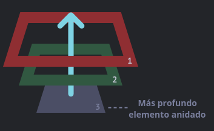
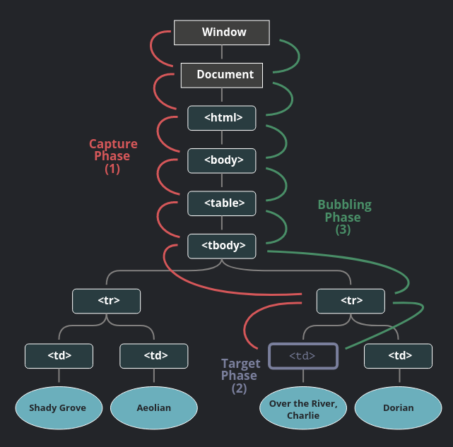
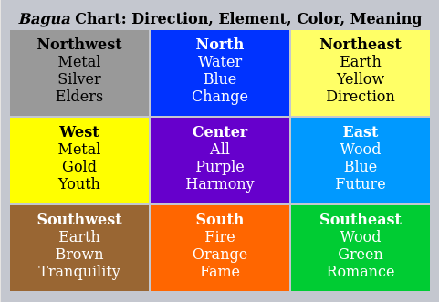

# DWEC UT03: Modelo de objetos del documento (DOM) y gestión de eventos.

## Gestión de eventos avanzada

Vamos a seguir profundizando en la gestión de eventos 

## El objeto `event`

Para manejar correctamente un evento necesitamos saber todavía más acerca de lo que está pasando. No solo si fue un “click” o un “teclazo”, sino ¿cuáles eran coordenadas del cursor, o qué tecla fue oprimida? Cuando un evento ocurre, el navegador crea un objeto del evento llamado `event`, coloca los detalles dentro y los pasa como un argumento al handler.

Aquí hay un ejemplo para obtener las coordenadas del cursor a partir del objeto del evento.

```html
<input type="button" value="¡Haz click en mí!" id="elem">

<script>
  const elem = document.getElementById("elem");
  elem.addEventListener("click", pulsado);
  
  const pulsado = (event) => {
    // muestra el tipo de evento, el elemento y las coordenadas del click
    alert(event.type + " en el " + event.currentTarget);
    alert("Coordenadas: " + event.clientX + ":" + event.clientY);
  };
</script>
```
Algunas propiedades del objeto event:

* event.**type**: Tipo de evento, en este caso fue "click".
* event.**currentTarget**: Elemento que maneja el evento. Lo que exactamente igual a this, a menos que el handler sea una función de flecha o su this esté vinculado a otra cosa, entonces podemos obtener el elemento desde event.currentTarget.
* event.**clientX** / event.**clientY**: Coordenadas del cursor relativas a la ventana, para eventos de cursor. 

Dicho evento contiene una serie de propiedades interesantes a la hora de trabajar con el evento en cuestión, y dependen del tipo de evento. Por ejemplo, en el ejemplo anterior hemos gestionado un evento `click`, por lo que el tipo de evento asociado es `PointerEvent`, y conlleva una serie de propiedades que no tienen porque estar presentes en otros tipos de eventos.

> Aqui podeis consultar todas las propiedades del objeto `event. [Enlace](https://developer.mozilla.org/en-US/docs/Web/API/Event#instance_properties)

## Propagación y captura
### Propagación

El principio de propagación es simple.

Cuando un evento ocurre en un elemento, este primero ejecuta los manejadores que tiene asignados, luego los manejadores de su padre, y así hasta otros ancestros.

Digamos que tenemos 3 elementos anidados `FORM > DIV > P` con un manejador en cada uno de ellos.
```html
<html>
<style>
  body * {
    margin: 10px;
    border: 1px solid blue;
  }
</style>

<body>
  <form onclick="alert('form')">FORM
    <div onclick="alert('div')">DIV
      <p onclick="alert('p')">P</p>
    </div>
  </form>
</body>
</html>
```
Un clic en el elemento del interior `<p>` primero ejecuta `onclick`:

1. En ese `<p>`.
2. Luego en el `<div>` de arriba.
3. Luego en el `<form>` de más arriba.

Y así sucesivamente hasta el objeto `document`. Este proceso se conoce como **propagación** porque los eventos “se propagan” desde el elemento más al interior, a través de los padres, como una burbuja en el agua.

<p align="center"> 

</p>

> #### *Tener en cuenta que ...*
> No todos los elementos se propagan. Por ejemplo, un evento `focus` no se propaga. Hay otros ejemplos también, los veremos. Pero aún así, esta es la excepción a la regla, la *mayoría de eventos sí se propagan*.

### Propiedad `event.target`

Un manejador en un elemento padre siempre puede obtener los detalles sobre dónde realmente ocurrió el evento. El elemento anidado más profundo que causó el evento es llamado elemento **objetivo**, accesible como `event.target.`

Hay que diferenciar bien entre estos 2 elementos:
* `event.target`: es el elemento “objetivo” que inició el evento, no cambia a través de todo el proceso de propagación.
* `this`: es el elemento “actual”, el que tiene un manejador ejecutándose en el momento.
```html
<html>
<head>
  <meta charset="utf-8">
  <style>
    form {
      background-color: green;
      position: relative;
      width: 150px;
      height: 150px;
      text-align: center;
      cursor: pointer;
    }
    div {
      background-color: blue;
      position: absolute;
      top: 25px;
      left: 25px;
      width: 100px;
      height: 100px;
    }
    p {
      background-color: red;
      position: absolute;
      top: 25px;
      left: 25px;
      width: 50px;
      height: 50px;
      line-height: 50px;
      margin: 0;
    }
    body {
      line-height: 25px;
      font-size: 16px;
    }
  </style>
</head>
<body>
  Un clic muestra ambos, el <code>event.target</code> y <code>this</code> para comparar:
  <form id="form">FORM
    <div>DIV
      <p>P</p>
    </div>
  </form>
  <script>
    form.onclick = function (event) {
      event.target.style.backgroundColor = 'yellow';
      // chrome needs some time to paint yellow
      setTimeout(() => {
        alert("target = " + event.target.tagName + ", this=" + this.tagName);
        event.target.style.backgroundColor = ''
      }, 0);
    };
  </script>
</body>
</html>
```

Por ejemplo, si tenemos un solo manejador `form.onclick`, este puede atrapar todos los clicks dentro del formulario. No importa dónde se hizo el clic, se propaga hasta el `<form>` y ejecuta el manejador.

En el manejador del formulario:
* `this`: es el elemento `<form>`, porque el manejador se ejecutó en él.
* `event.target`: es el elemento actual dentro de el formulario al que se le hizo clic.

Es posible que `event.target` sea igual a `this`: ocurre cuando el clic se hace directamente en el elemento `<form>`.

### Detener la propagación

Una propagación de evento empieza desde el elemento objetivo hacia arriba. Normalmente este continúa hasta `<html>` y luego hacia el objeto `document`, algunos eventos incluso alcanzan `window`, llamando a todos los manejadores en el camino.

Pero cualquier manejador podría decidir que el evento se ha procesado por completo y detener su propagación. El método para esto es `event.stopPropagation()`.

```html
<body onclick="alert(`No se propagó hasta aquí`)">
  <button onclick="event.stopPropagation()">Haz clic</button>
</body>
```

> #### *Tener en cuenta que ...*
> Si un elemento tiene múltiples manejadores para un solo evento, aunque uno de ellos detenga la propagación, los demás aún se ejecutarán. En otras palabras, `event.stopPropagation()` detiene la propagación hacia arriba, pero todos los manejadores en el elemento actual se ejecutarán.
> Para detener la propagación y prevenir que los manejadores del elemento actual se ejecuten, hay un método `event.stopImmediatePropagation()`. Después de él, ningún otro manejador será ejecutado.

### Captura

Hay otra fase en el procesamiento de eventos llamada **captura**. Es raro usarla en código real, pero a veces puede ser útil. El estándar de eventos del DOM describe 3 fases de la propagación de eventos:

* Fase de **captura**: el evento desciende al elemento.
* Fase de **objetivo**: el evento alcanza al elemento.
* Fase de **propagación**: el evento se propaga hacia arriba del elemento.

Aquí (tomada de la especificación), tenemos la imagen de las fases de captura (1), objetivo (2), y propagación (3), de un evento click en un `<td>` dentro de una tabla:

<p align="center"> 

</p>

Se explica así: por un clic en `<td>` el evento va primero a través de la cadena de ancestros hacia el elemento (fase de captura), luego alcanza el objetivo y se desencadena ahí (fase de objetivo), y por último va hacia arriba (fase de propagación), ejecutando los manejadores en su camino.

Hasta ahora solo hablamos de la propagación, porque la fase de captura es raramente usada. De hecho, la fase de captura es invisible para nosotros, porque los manejadores agregados que usan la propiedad `on<event>`, ó usan atributos HTML, ó `addEventListener(event, handler)` de dos argumentos, no ven la fase de captura, únicamente se ejecutan en la 2da y 3ra fase.

Para atrapar un evento en la fase de captura, necesitamos preparar la opción `capture` como `true` en el manejador de `addEventListener`.

### Opciones de `addEventListener`

Al utilizar el método `addEventListener`, se puede indicar un tercer parámetro opcional. Se trata de un objeto opcional en el cual podemos indicar alguna de las siguientes opciones para modificar alguna característica del listener en cuestión que vamos a crear:

* En primer lugar, la opción `capture` nos permite modificar la modalidad en la que escuchará el evento (`capture/bubble`). Esto, básicamente, lo que hace es modificar en que momento se procesa el evento.
* En segundo lugar, la opción `once` nos permite indicar que el evento se procesará solo la primera vez que se dispare un evento. Internamente, lo que hace es ejecutarse una primera vez y luego llamar al `removeEventListener`, eliminando el listener una vez ha sido ejecutado.
* En tercer y último lugar, la opción `passive` nos permite crear un evento pasivo en el que indicamos que nunca llamaremos al método `preventDefault()` para alterar el funcionamiento del evento.

Aunque se pueden especificar con notación de objeto, en realidad no se suelen utilizar en exceso es por eso que si solo indicamos `true/false` estamos haciendo referencia la propiedad de `capture`.

```js
elem.addEventListener(..., {capture: true})
// o solamente "true". Es una forma más corta de {capture: true}
elem.addEventListener(..., true)

...

document.body.addEventListener('click', () => {
  console.log('I run only once! 😇');
}, { once: true });
// sería equivalente a esto
document.body.addEventListener('click', cb);

function cb() {
  console.log('Hi! 👋');
  document.body.removeEventListener('click', cb);
}
```

Podeis porbar este ejemplo y ver como reacciona cuando haceis click en algún elemento de la página.

```html
<html>
<head>
  <style>
    body * {
      margin: 10px;
      border: 1px solid blue;
    }
  </style>
</head>
<body>
  <form>FORM
    <div>DIV
      <p>P</p>
    </div>
  </form>
  <script>
    for (let elem of document.querySelectorAll('*')) {
      elem.addEventListener("click", e => alert(`Captura: ${elem.tagName}`), true);
      elem.addEventListener("click", e => alert(`Propagación: ${elem.tagName}`));
    }
  </script>
</body>
</html>
```

> Para navegadores antiguos como IE, el método `addEventListener` no está soportado. Era normal que se hicieran comprobaciones para saber si estabamos ejecutando el código en uno de esos navegadores. [Enlace](https://developer.mozilla.org/es/docs/Web/API/EventTarget/addEventListener#legacy_internet_explorer_and_attachevent).


### Delegación de eventos

La captura y el propagación nos permiten implementar uno de los más poderosos patrones de manejo de eventos llamado delegación de eventos. La idea es que si tenemos muchos elementos manejados de manera similar podemos, en lugar de asignar un manejador a cada uno de ellos, poner un único manejador a su ancestro común.

En el manejador obtenemos `event.target` para ver dónde ocurrió realmente el evento y manejarlo.

<p align="center"> 
</p><p align="center"><a href="https://plnkr.co/edit/d3P9pkFZjFfCmqPi?p=preview&preview">Enlace a ejemplo</a>
</p>

La tabla tiene 9 celdas, pero puede haber 99 o 999, eso no importa. Nuestra tarea es destacar una celda `<td>` al hacer clic en ella. En lugar de asignar un manejador onclick a cada `<td>` (puede haber muchos), configuramos un manejador “atrapa-todo” en el elemento `<table>`.

Este usará `event.target` para obtener el elemento del clic y destacarlo.

```js
let selectedTd;

table.onclick = function(event) {
  let target = event.target; // ¿dónde fue el clic?
  if (target.tagName != 'TD') return; // ¿no es un TD? No nos interesa
  highlight(target); // destacarlo

  function highlight(td) {
  if (selectedTd) { // quitar cualquier celda destacada que hubiera antes
    selectedTd.classList.remove('highlight');
  }
  selectedTd = td;
  selectedTd.classList.add('highlight'); // y destacar el nuevo td
}
};
```

A este código no le interesa cuántas celdas hay en la tabla. Podemos agregar y quitar `<td>` dinámicamente en cualquier momento y el realzado aún funcionará.

Pero hay un inconveniente. El clic puede ocurrir no sobre `<td>`, sino dentro de él. En nuestro caso, si miramos dentro del HTML, podemos ver tags anidados dentro de `<td>`, como `<strong>`. Naturalmente, si el clic ocurre en `<strong>`, este se vuelve el valor de `event.target`.

Una manera de resolver esto sería aplicar alguna mejora al código.

```js
table.onclick = function(event) {
  let td = event.target.closest('td'); // (1)
  if (!td) return; // (2)
  if (!table.contains(td)) return; // (3)
  highlight(td); // (4)
};
```

1. El método `elem.closest(selector)` devuelve el ancestro más cercano que coincide con el selector. En nuestro caso buscamos `<td>` hacia arriba desde el elemento de origen.
2. Si `event.target` no ocurrió dentro de algún `<td>`, el llamado retorna inmediatamente pues no hay nada que hacer.
3. En caso de tablas anidadas, `event.target` podría ser un `<td>`, pero fuera de la tabla actual. Entonces verificamos que sea realmente un `<td>` de nuestra tabla.

Otra manera podría ser esta (está hecha en el ejemplo por defecto!!).
```js
    table.onclick = function (event) {
      let target = event.target;
      while (target != this) {
        if (target.tagName == 'TD') {
          highlight(target);
          return;
        }
        target = target.parentNode;
      }
    }
```
1. Mientras que `target` no sea igual al formulario (donde tenemos el manejador), seguira en el bucle.
2. Se compara si `target` es una celda (TD).
3. Si no lo és, cambia la variable `target` por el padre del elemento que inició el evento.
4. Vuelve a comprobar si es una celda (TD).

Hay otros usos para la delegación de eventos. Digamos que queremos hacer un menú con los botones “Save”, “Load”, “Search” y así. Y hay objetos con los métodos save, load, search… ¿Cómo asociarlos?

La primera idea podría ser asignar un controlador separado para cada botón. Pero hay una solución más elegante. Podemos agregar un controlador para el menú completo y un atributo `data-action` a los botones con el método a llamar.

```html
<body>
  <div id="menu">
    <button data-action="save">Save</button>
    <button data-action="load">Load</button>
    <button data-action="search">Search</button>
  </div>
  <script>
    let div = document.getElementById("menu");
    div.onclick = (event) => {
      let action = event.target.dataset.action;
      if (action) {
        this[action]();
      }
    }
    function save() {
      alert('saving');
    }
    function load() {
      alert('loading');
    }
    function search() {
      alert('searching');
    }
  </script>
</body>
```